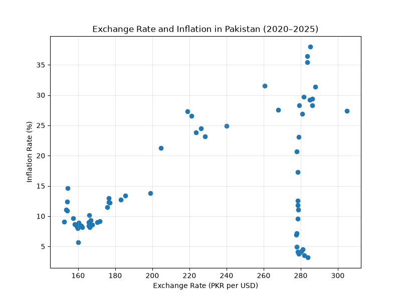
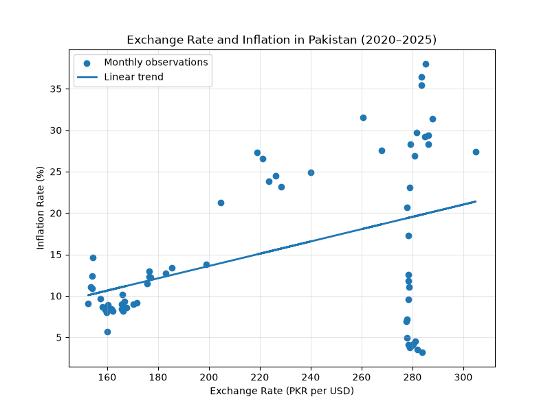
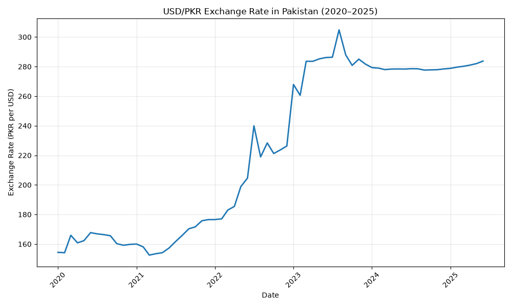
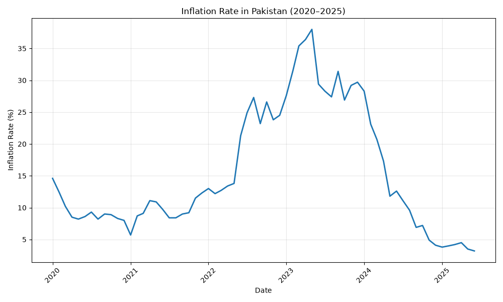
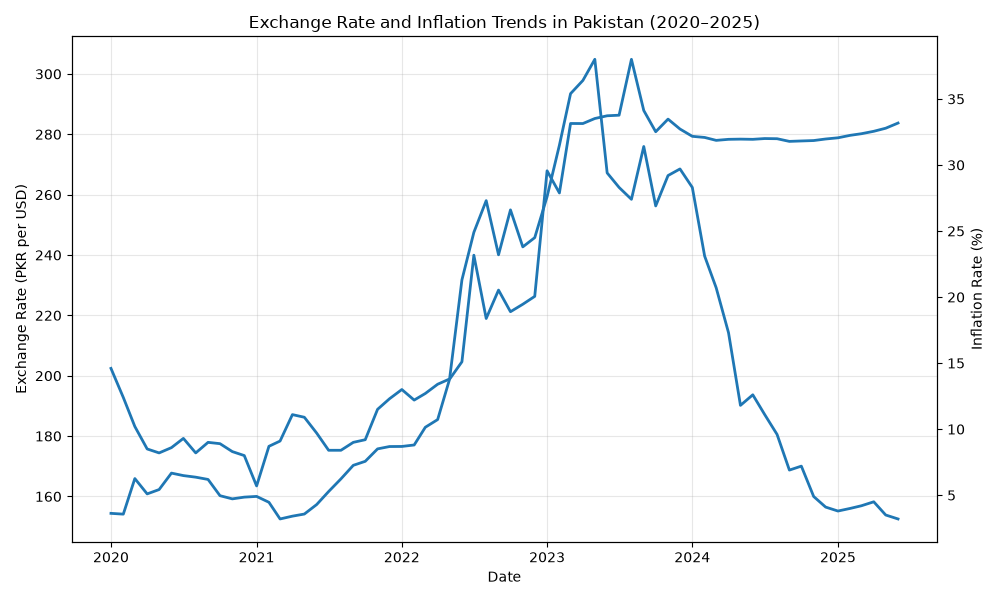
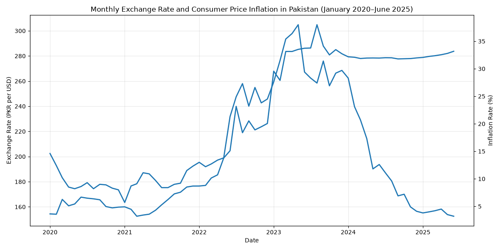

# Exchange Rate Movements and Consumer Price Inflation in Pakistan: A Monthly Descriptive and Correlation Analysis, 2020–2025 [SSRN]

**Author:** Tooba Khalil  
**Affiliation:** Department of Economics, Government College University (GCU) Lahore, Pakistan  
**Status:** Working Paper (August 2026)  

---

## 📌 Project Overview
This repository provides a fully reproducible Python-based empirical analysis examining the statistical relationship between nominal exchange rate movements (USD/PKR) and consumer price inflation (CPI) in Pakistan. Covering 66 monthly observations from January 2020 to June 2025, this project transitions traditional macroeconomic research into an open-source data science pipeline.

## 📄 Working Paper & Replication Data
* **Research Paper PDF:** [Click here to open your uploaded PDF file](./) *(Note: You can click the PDF file directly from the file list above to view your full paper)*
* **SSRN Link:** [View Live Paper on SSRN](https://ssrn.com)

* **Empirical Code Engine:** `analysis.py` contains the computational workflow using `pandas`, `statsmodels`, and `seaborn`.

## 📊 Complete Macroeconomic Visualization Suite

Below are the 6 structural empirical plots generated programmatically via `analysis.py` to map tracking cycles, data distributions, and correlation tracking across the 66-month observation matrix:

<table align="center">
  <tr>
    <td align="center"><b>Figure 1: Bivariate Scatter Distribution</b> </td>
    <td align="center"><b>Figure 2: Linear Regression Fit Line</b> </td>
  </tr>
  <tr>
    <td align="center"><b>Figure 3: USD/PKR Monthly Exchange Rate</b> </td>
    <td align="center"><b>Figure 4: Consumer Price Inflation (CPI) Trend</b> </td>
  </tr>
  <tr>
    <td align="center"><b>Figure 5: Macro Co-Movements Over Time</b> </td>
    <td align="center"><b>Figure 6: Standardized Variable Tracking</b> </td>
  </tr>
</table>
>

---

## 📬 Contact & Credentials
* **Email:** toobakhalil508@gmail.com
* **LinkedIn:** [www.linkedin.com/in/tooba-khalil-a12038415]
* 

